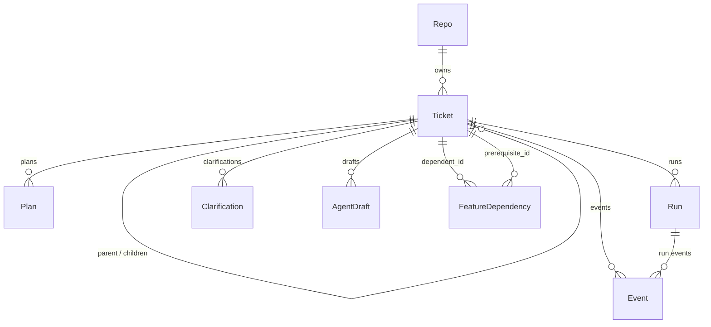

# Data model reference

The Pravi backend persists everything it needs to drive tickets through the
architect → developer → reviewer loop in a single Postgres database. SQLAlchemy
ORM models live in [`src/pravi/db/models.py`](../../src/pravi/db/models.py);
schema migrations are managed by Alembic (see [Migrations](#migrations)).

This page documents every model: what it represents, the columns that matter,
and how it connects to the rest of the graph. For the *why* behind some of the
design choices, see the linked ADRs.

## Conventions

A couple of shared idioms cut across most tables:

- **`Base`** — declarative base for all models.
- **`TimestampMixin`** — adds `created_at` and `updated_at` (timezone-aware,
  server-defaulted, auto-updated on write). Most tables use it; pure
  append-only join/event tables (`FeatureDependency`, `Event`) skip the
  `updated_at` half and keep just `created_at` / `at`.
- **IDs** — `BigInteger` autoincrement primary keys everywhere.
- **Enums** — stored as short `String` columns (not Postgres enum types) so
  rolling out a new variant doesn't require a schema migration. The
  Python-side `StrEnum` classes are the source of truth.

## Ticket hierarchy and run children



ASCII view of the three-level ticket hierarchy and the per-task children:

```
Repo
 └── Ticket (kind=epic, parent_id=NULL)
      └── Ticket (kind=feature, parent_id=epic.id)
           │     ├── FeatureDependency (dependent_id → prerequisite_id, same epic)
           │
           └── Ticket (kind=task, parent_id=feature.id)
                ├── Clarification*   (architect clarify call, latest wins)
                ├── AgentDraft*      (decompose | plan, latest per kind wins)
                ├── Plan*            (approved plan documents)
                ├── Run*             (architect | developer | reviewer | tester)
                │    └── Event*      (per-run timeline)
                └── Event*           (lifecycle, not tied to a run)
```

Only `task`-kind tickets execute a `FeatureWorkflow` today; epics and features
are organizational containers. Auto-decomposition of an epic into features +
tasks is queued as a follow-up.

## Models

### `Repo` — `repos`

A repository Pravi can work in. Tickets always belong to one.

| Column | Notes |
| --- | --- |
| `id` | PK. |
| `name` | Unique display name. |
| `local_path` | Filesystem checkout path. **Nullable** (ADR 0003): GitHub-imported repos populate this lazily when the sandbox provisions on first dev run. Treat empty/null as "ask the sandbox to resolve me." |
| `github_owner`, `github_name` | Set when the repo originated from GitHub import. |

**Relationships:** `tickets` → `Ticket` (back-populated).

### `Ticket` — `tickets`

The central unit of work. Tickets form a three-level hierarchy via
`(kind, parent_id)`:

- `kind=epic` — top-level container; `parent_id` is NULL.
- `kind=feature` — child of an epic; `parent_id` is always set.
- `kind=task` — leaf; the only kind that runs a workflow. `parent_id` may
  be a feature or NULL for standalone tasks.

| Column | Notes |
| --- | --- |
| `id` | PK. |
| `repo_id` | FK → `repos.id`. |
| `external_id` | Stable external identifier (e.g. `t-d0de6a84`). |
| `title`, `body` | Human-readable summary + body. |
| `domain_name` | Domain slug the architect assigned. |
| `status` | `TicketStatus`: `pending`, `planning`, `plan_approved`, `in_progress`, `pr_open`, `merged`, `failed`, `cancelled`. |
| `workflow_id` | Current Temporal workflow ID, if running. |
| `pr_number` | GitHub PR number once a draft PR is opened. |
| `github_issue_url` | Source URL if imported from a GitHub issue; surfaced in the UI as a "from GitHub #N" chip. |
| `persona`, `stack` | Agent persona + stack (ADR 0004). Both nullable: null persona → `other` (generic prompt); null stack → `unknown` (no skill hint). |
| `kind` | `TicketKind`: `epic` / `feature` / `task`. Defaults to `task`. |
| `parent_id` | Self-FK → `tickets.id` (`ON DELETE SET NULL`). |
| `cost_ceiling_usd` | Cumulative USD cap. Null = inherit from parent → env default → unlimited. Enforced pre-flight before each dev run; SDK per-run cap is clamped to the remaining budget. |

**Indexes:** `ix_tickets_parent_id`, `ix_tickets_repo_id_kind`.

**Relationships:** `repo`, `parent` / `children`, `plans`, `runs`, `events`.
Clarifications, agent drafts, and feature-dependency rows reference tickets
but aren't exposed as ORM relationships on `Ticket`.

### `GitHubConnection` — `github_connections`

Persisted OAuth token used to talk to GitHub on the user's behalf.
Single-user local-dev model: the **latest non-revoked row** is "the connection."
Logout sets `revoked_at`; re-auth inserts a fresh row rather than mutating the
existing one, so there's an audit trail (401 → re-auth → two rows, the new one
is active).

| Column | Notes |
| --- | --- |
| `id` | PK. |
| `access_token` | Bearer token (`Text`). |
| `scopes` | Space-separated as returned by GitHub. |
| `github_user_id`, `github_user_login`, `github_user_avatar_url` | Cached identity. |
| `revoked_at` | Nullable. Non-null rows are skipped by the "current connection" lookup. |

**Index:** `ix_github_connections_revoked_at_id` covers the hot
"latest-non-revoked" lookup.

### `Clarification` — `clarifications`

One architect "clarify" call against an epic. Persisted (rather than
streamed-and-forgotten) so the user can close the tab, reload, or navigate
away while the architect is thinking. The latest row per ticket is what the UI
displays; re-clarifying inserts a fresh row.

`raw_md` is updated incrementally as the architect streams tokens; the UI
partial-parses it for progressive display while polling.

| Column | Notes |
| --- | --- |
| `id` | PK. |
| `ticket_id` | FK → `tickets.id` (`ON DELETE CASCADE`). |
| `status` | `ClarifyStatus`: `pending` / `running` / `done` / `failed`. |
| `raw_md` | Streamed markdown buffer. |
| `questions` | JSON list of `{text, why}` once `status=done`. |
| `prompt_version`, `num_turns`, `duration_ms`, `total_cost_usd` | Architect-run telemetry. |
| `error` | Failure message if `status=failed`. |
| `started_at`, `completed_at` | Lifecycle timestamps (separate from `created_at`). |

**Index:** `ix_clarifications_ticket_id_id` — descending `id` is the
sub-second tiebreaker for "latest clarification for ticket."

### `AgentDraft` — `agent_drafts`

Same lifecycle contract as `Clarification`, but generalized to any long-running
architect "draft" call. Today the discriminator covers two modes:

- `decompose` — break an epic into features + tasks.
- `plan` — produce a plan-draft for a task.

Latest row per `(ticket_id, kind)` is the live one for the UI. Old rows stay
for audit. The pattern (persist → background streaming writer → poll) keeps the
persistence + UI behaviour uniform across new architect modes.

| Column | Notes |
| --- | --- |
| `id` | PK. |
| `ticket_id` | FK → `tickets.id` (`ON DELETE CASCADE`). |
| `kind` | `AgentDraftKind`: `decompose` / `plan`. |
| `status` | `AgentDraftStatus`: `pending` / `running` / `done` / `failed`. |
| `raw_md` | Streamed markdown (+ tool-use comment markers). |
| `payload` | Parsed result, shape varies by kind: <br>• `decompose`: `{"features": [{title, description, domain, depends_on, tasks: [{title, description}]}, ...]}` <br>• `plan`: `{"plan_md": "...", "domain_name": "..."}` |
| `prompt_version`, `num_turns`, `duration_ms`, `total_cost_usd` | Architect-run telemetry. |
| `error` | Failure message if `status=failed`. |
| `started_at`, `completed_at` | Lifecycle timestamps. |

**Index:** `ix_agent_drafts_ticket_kind_id` covers the "latest draft for
ticket + kind" poll.

### `FeatureDependency` — `feature_dependencies`

`dependent_id` depends on `prerequisite_id` — both must be features under the
same epic. Enforced at the application layer; the schema only enforces that
both rows are tickets and that the two IDs differ. Cycles are rejected at
insert time.

Used by the roadmap view: a topological sort groups features into "waves"
where each wave's features can be worked on in parallel and later waves
require earlier ones to be done.

| Column | Notes |
| --- | --- |
| `id` | PK. |
| `dependent_id` | FK → `tickets.id` (`ON DELETE CASCADE`). |
| `prerequisite_id` | FK → `tickets.id` (`ON DELETE CASCADE`). |
| `created_at` | Server-set; this table doesn't use `TimestampMixin`. |

**Constraints + indexes:** unique `(dependent_id, prerequisite_id)`
(`uq_feature_dep`); `dependent_id <> prerequisite_id` (`ck_feature_dep_no_self`);
`ix_feature_deps_dependent`, `ix_feature_deps_prerequisite`.

### `Plan` — `plans`

The approved plan document for a ticket. The architect produces the draft
(see `AgentDraft` with `kind=plan`); once a user approves, a `Plan` row is
written and used as the dev agent's working brief.

| Column | Notes |
| --- | --- |
| `id` | PK. |
| `ticket_id` | FK → `tickets.id`. |
| `domain_name` | Domain the plan applies to. |
| `domain_snapshot` | JSON snapshot of the domain config at approval time (so reruns aren't broken by later domain edits). |
| `content_md` | Plan markdown. |
| `approved_at`, `approved_by` | Approval audit. |

**Relationship:** `ticket` → `Ticket`.

### `Run` — `runs`

One agent execution against a ticket. Kinds:

- `architect` — clarify, decompose, plan-draft.
- `developer` — the dev agent inside the sandbox (ADR 0003).
- `reviewer` — post-PR review pass.
- `tester` — test-shaped runs (reserved for the test-loop slice).

| Column | Notes |
| --- | --- |
| `id` | PK. |
| `ticket_id` | FK → `tickets.id`. |
| `kind` | `RunKind`. |
| `status` | `RunStatus`: `started` / `succeeded` / `failed` / `budget_exhausted`. |
| `iteration` | Retry counter for the same logical step. |
| `model` | Model identifier (e.g. `claude-sonnet-4`). |
| `prompt_version` | Prompt revision tag — pairs with the agent-run telemetry on `AgentDraft` / `Clarification`. |
| `tokens_in`, `tokens_out` | Accumulated token usage. |
| `started_at`, `ended_at` | Lifecycle timestamps. |
| `transcript` | Optional full transcript (large). |
| `error` | Failure message if `status=failed`. |

**Relationship:** `ticket` → `Ticket`. `Event` rows reference `runs.id`
for per-run timelines.

### `Event` — `events`

Append-only timeline rows. Two use cases:

1. **Per-run timeline** — `run_id` set; powers the UI's run-detail view.
2. **Lifecycle events** — `run_id` NULL; e.g. ticket created, PR merged.

| Column | Notes |
| --- | --- |
| `id` | PK. |
| `ticket_id` | FK → `tickets.id`. |
| `run_id` | FK → `runs.id`, nullable. |
| `at` | Server-set timestamp. |
| `kind` | Short event-type string (free-form). |
| `message` | Human-readable summary. |
| `payload` | Optional structured JSON. |

**Indexes:** `ix_events_ticket_id_id` (ticket replay: "events since id X");
`ix_events_run_id_id` (per-run timeline).

This table doesn't use `TimestampMixin` — it has `at` instead of
`created_at`/`updated_at`, since rows are immutable once written.

## Migrations

Alembic config lives at the repo root in [`alembic.ini`](../../alembic.ini);
the script location is [`src/pravi/db/migrations/`](../../src/pravi/db/migrations/)
with revision files in
[`src/pravi/db/migrations/versions/`](../../src/pravi/db/migrations/versions/).

Notable revisions, in dependency order:

| Revision | Adds |
| --- | --- |
| `38b585b5fd5a_initial` | Base schema (repos, tickets, plans, runs, events). |
| `a9c3e51b7f02_repos_local_path_nullable` | Makes `repos.local_path` nullable (ADR 0003). |
| `45ce5d528341_github_connections_table` | `github_connections`. |
| `a1f3c9b2d4e6_events_run_id` | Adds `events.run_id` + index. |
| `daf5d2562f80_clarifications_table` | `clarifications`. |
| `461d70ada9af_ticket_hierarchy_kind_parent_id` | `tickets.kind` + `parent_id` + hierarchy indexes. |
| `e3a7f9c8b1d2_agent_drafts_table` | `agent_drafts`. |
| `b7751ed99d5e_feature_dependencies` | `feature_dependencies`. |
| `c4e2b8d6f1a9_ticket_persona_stack` | `tickets.persona`, `tickets.stack` (ADR 0004). |
| `c2a8d4e7f1b9_ticket_cost_ceiling` | `tickets.cost_ceiling_usd`. |
| `f5b8a2c3d4e7_ticket_github_issue_url` | `tickets.github_issue_url`. |

To generate a new revision after editing `models.py`:

```sh
uv run alembic revision --autogenerate -m "short description"
uv run alembic upgrade head
```

Review the autogenerate output before committing — Alembic sometimes misses
index renames or enum-string-length tweaks that need a hand edit.
